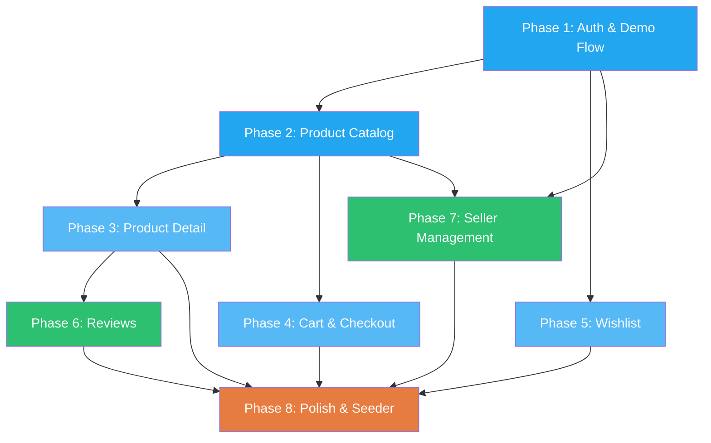

# Lumon E-Commerce — Master Execution Plan

> **Stack**: Laravel 13 + Inertia.js + React 19 + Tailwind CSS 3 + Sanctum SPA Auth  
> **Database**: SQLite (dev) | **State**: Zustand  
> **Existing Assets**: Landing page (Home), Navbar (role-aware), Layout, Footer, ProductCard, design tokens in `tailwind.config.js`

---

## Current-State Audit Summary

### What Exists ✅

| Layer | Status | Files |
|-------|--------|-------|
| **Models** | User, Product, Category, Cart, CartItem, Order, OrderItem | 7 models |
| **Migrations** | users, categories, products, carts, cart_items, orders, order_items, personal_access_tokens | 11 migration files |
| **Controllers** | Auth (register/login/logout), Product (CRUD + search/filter/sort), Cart (CRUD), Order (checkout + admin), Category (index/show) | 6 controllers |
| **API Resources** | ProductResource, CartResource, CartItemResource, OrderResource, OrderItemResource, CategoryResource | 6 resources |
| **Middleware** | `AdminMiddleware` (checks `is_admin`), `HandleInertiaRequests` (shares `auth.user`) | 2 middleware |
| **Frontend Pages** | Home (complete), Shop/Login/Register/Cart (stub placeholders) | 5 pages |
| **Components** | HeroSlider, EditorsPick, FeaturedProducts, FeaturesSection, TestimonialSection, NewsletterSection, Navbar (role-aware), Footer, Layout, Button, ProductCard | 12 components |
| **State** | `useAuthStore` (Zustand — login/register/logout/checkAuth) | 1 store |
| **Seeder** | 5 categories × 10 products + 1 test user | Basic |

### Critical Gaps 🔴

| Gap | Impact |
|-----|--------|
| **No `role` column on `users`** | Using `is_admin` boolean — need `role` enum (`buyer`/`seller`) for dual-role auth |
| **No `seller_id` on `products`** | Products are unowned — no multi-vendor attribution |
| **No `image` / `images` on `products`** | ProductCard hardcodes `/category-men.png` |
| **No `reviews` table** | No ratings, no computed average |
| **No `wishlists` table** | No favorites system |
| **No `product_variants` table** | No size/variant handling |
| **Auth uses bearer tokens, not SPA cookies** | `useAuthStore` calls `/api/login` and stores tokens, but Inertia shares `auth.user` via session — **architectural mismatch** |
| **`AdminMiddleware`** checks `is_admin` but the spec asks for `seller` role — need a `SellerMiddleware` |
| **Seeder** generates random faker words — not realistic e-commerce data |
| **No `zustand` in `package.json`** | `useAuthStore` imports zustand but it's not a listed dependency |
| **Duplicate `/api/user` route** | Defined twice in [api.php](file:///c:/Users/somet/Downloads/Coding/Lumon/routes/api.php) (L11 and L38) |
| **Logout route** in Navbar calls `router.post('/logout')` — but logout is on `/api/logout` |
| **No demo accounts** seeded | No one-click recruiter demo access |
| **Frontend pages** Shop, Login, Register, Cart are all stubs | No real UI |

---

## Architectural Decisions (Pre-Implementation)

> [!IMPORTANT]
> These decisions must be locked before any code is written.

### 1. Authentication Strategy: Inertia SPA Cookie Auth (NOT Bearer Tokens)

Since this is an Inertia.js app (server renders the initial page, shares `auth.user` via middleware), **we should use Sanctum's cookie-based SPA authentication**, not bearer tokens. The current `AuthController` returns JSON tokens — this needs to be refactored to **session-based login** that works with Inertia's `router.post()` pattern.

**Decision**: 
- Login/Register via Inertia `router.post('/login')` → controller logs in via `Auth::attempt()` → redirects back → Inertia shares `auth.user`
- Drop the `useAuthStore` Zustand store for auth — use Inertia's shared props instead (`usePage().props.auth.user`)
- Keep Zustand **only** for client-side ephemeral state (cart drawer, toast notifications, wishlist optimistic UI)

### 2. Role System: `role` Enum Column

Replace `is_admin` with a `role` enum column: `buyer` | `seller`. Sellers can manage their own products. Buyers can purchase, review, and wishlist.

### 3. Product Ownership

Add `seller_id` (FK → `users.id`) to `products`. Sellers can only CRUD their own products. The `AdminMiddleware` becomes `SellerMiddleware`.

### 4. Image Strategy

Add `image_url` (string, nullable) to `products` for the primary image. For the portfolio scope, use static seed images from `/public/images/products/`. No file upload to disk in Phase 1 — add it in Phase 7.

---

## Phase 1 — Authentication, Authorization & Recruiter Demo Flow

### 1.1 Database Migrations

```
Migration: modify_users_table_add_role
```

```php
// Changes to users table:
// - DROP column: is_admin
// - ADD column: role ENUM('buyer', 'seller') DEFAULT 'buyer' AFTER email
```

| Column | Type | Default | Notes |
|--------|------|---------|-------|
| `role` | `string` (enum enforced in model) | `'buyer'` | Replaces `is_admin` |

### 1.2 Model Changes

**[User.php](file:///c:/Users/somet/Downloads/Coding/Lumon/app/Models/User.php)**

```diff
  protected $fillable = [
      'name',
      'email',
      'password',
-     'is_admin',
+     'role',
  ];

  protected function casts(): array
  {
      return [
          'email_verified_at' => 'datetime',
          'password' => 'hashed',
-         'is_admin' => 'boolean',
      ];
  }

+ public function isSeller(): bool
+ {
+     return $this->role === 'seller';
+ }
+
+ public function isBuyer(): bool
+ {
+     return $this->role === 'buyer';
+ }
+
+ // Seller's products
+ public function products(): HasMany
+ {
+     return $this->hasMany(Product::class, 'seller_id');
+ }
+
+ public function reviews(): HasMany
+ {
+     return $this->hasMany(Review::class);
+ }
+
+ public function wishlists(): BelongsToMany
+ {
+     return $this->belongsToMany(Product::class, 'wishlists')->withTimestamps();
+ }
```

### 1.3 Middleware Changes

**Replace `AdminMiddleware` → `SellerMiddleware`**

```php
// app/Http/Middleware/SellerMiddleware.php
// Checks: $request->user() && $request->user()->isSeller()
// 403 JSON if not seller
```

**Update [bootstrap/app.php](file:///c:/Users/somet/Downloads/Coding/Lumon/bootstrap/app.php)**

```diff
  $middleware->alias([
-     'admin' => AdminMiddleware::class,
+     'seller' => SellerMiddleware::class,
  ]);
```

### 1.4 Controller Refactor — Session-Based Auth

**Refactored [AuthController.php](file:///c:/Users/somet/Downloads/Coding/Lumon/app/Http/Controllers/AuthController.php)**

| Method | Route | Behavior |
|--------|-------|----------|
| `showLogin()` | `GET /login` | Inertia::render('Login') |
| `login()` | `POST /login` | `Auth::attempt()` → redirect to `/` or intended |
| `showRegister()` | `GET /register` | Inertia::render('Register') |
| `register()` | `POST /register` | Create user → `Auth::login()` → redirect |
| `logout()` | `POST /logout` | `Auth::guard('web')->logout()` → invalidate session → redirect `/` |
| `demoLogin()` | `POST /demo-login` | Accepts `{role: 'buyer'|'seller'}` → logs in as seeded demo account → redirect `/` |

### 1.5 Web Routes Update

```php
// routes/web.php — Auth routes (move from api.php to web.php for session auth)
Route::middleware('guest')->group(function () {
    Route::get('/login', [AuthController::class, 'showLogin'])->name('login');
    Route::post('/login', [AuthController::class, 'login']);
    Route::get('/register', [AuthController::class, 'showRegister'])->name('register');
    Route::post('/register', [AuthController::class, 'register']);
    Route::post('/demo-login', [AuthController::class, 'demoLogin']);
});

Route::post('/logout', [AuthController::class, 'logout'])->middleware('auth');
```

### 1.6 API Routes Cleanup

**[api.php](file:///c:/Users/somet/Downloads/Coding/Lumon/routes/api.php)**:
- Remove duplicate `/api/user` route (L11-13 and L38-40)
- Change `admin` middleware → `seller` on product CRUD routes
- Remove auth routes (moved to web)
- Keep protected cart, order, and product management endpoints

### 1.7 Seeder — Demo Accounts

```php
// In DatabaseSeeder.php:
User::create([
    'name' => 'Demo Buyer',
    'email' => 'buyer@lumon.demo',
    'password' => Hash::make('password'),
    'role' => 'buyer',
]);

User::create([
    'name' => 'Demo Seller',
    'email' => 'seller@lumon.demo',
    'password' => Hash::make('password'),
    'role' => 'seller',
]);
```

### 1.8 React Components

#### New Pages

| Page | Path | Notes |
|------|------|-------|
| `Login.jsx` | `/login` | Email/password form + "Login as Demo Buyer" + "Login as Demo Seller" buttons |
| `Register.jsx` | `/register` | Name/email/password/confirm + role selector (radio: Buyer/Seller) |

#### Component Architecture — Login Page

```
Login.jsx
├── Layout
├── <form> (email, password, submit)
├── DemoAccessSection
│   ├── Button "Login as Demo Buyer"  → POST /demo-login {role:'buyer'}
│   └── Button "Login as Demo Seller" → POST /demo-login {role:'seller'}
└── Link → /register
```

#### State Management

- **No Zustand for auth** — use `usePage().props.auth.user` (Inertia shared data)
- **Delete `useAuthStore.js`** — replaced by Inertia's built-in approach
- Form state handled by Inertia's `useForm()` hook

#### Edge Cases

| Edge Case | Guard |
|-----------|-------|
| Logged-in user visits `/login` or `/register` | `guest` middleware → redirect to `/` |
| CSRF token mismatch | Inertia handles 419 automatically → page refresh |
| Demo account deleted from DB | `demoLogin()` returns 404 with helpful error |
| Validation errors | Inertia auto-shares `errors` prop → display inline |
| Rate limiting login | Apply `throttle:5,1` middleware to `POST /login` |

---

## Phase 2 — Product Catalog & Search/Sort (`/products`)

### 2.1 Database Migrations

```
Migration: add_seller_id_and_image_to_products
```

| Column | Type | Notes |
|--------|------|-------|
| `seller_id` | `foreignId()->constrained('users')->onDelete('cascade')` | Product owner |
| `image_url` | `string()->nullable()` | Primary product image URL |

### 2.2 Model Changes

**[Product.php](file:///c:/Users/somet/Downloads/Coding/Lumon/app/Models/Product.php)**

```diff
  protected $fillable = [
+     'seller_id',
      'name',
      'slug',
      'description',
      'price',
      'stock',
      'is_active',
      'category_id',
+     'image_url',
  ];

+ public function seller(): BelongsTo
+ {
+     return $this->belongsTo(User::class, 'seller_id');
+ }
+
+ public function reviews(): HasMany
+ {
+     return $this->hasMany(Review::class);
+ }
+
+ // Computed: average review rating
+ public function getAverageRatingAttribute(): float
+ {
+     return round($this->reviews()->avg('rating') ?? 0, 1);
+ }
+
+ public function getReviewCountAttribute(): int
+ {
+     return $this->reviews()->count();
+ }
```

### 2.3 API Endpoint Changes

**`GET /api/products`** — Enhanced [ProductController::index()](file:///c:/Users/somet/Downloads/Coding/Lumon/app/Http/Controllers/ProductController.php#L63-L132)

Current filters (keep): `search`, `category_id`, `category` (slug), `min_price`, `max_price`, `sort_by`, `sort_order`

**Add**:
| Parameter | Type | Behavior |
|-----------|------|----------|
| `sort_by=rating` | string | Sort by computed `avg(reviews.rating)` via subquery |
| `per_page` | integer (default 12) | Configurable page size (max 48) |

**Sort by rating implementation** — use a subquery to avoid N+1:

```php
if ($sortBy === 'rating') {
    $query->withAvg('reviews', 'rating')
          ->orderBy('reviews_avg_rating', $sortOrder);
} else {
    $query->orderBy($sortBy, $sortOrder);
}
```

**ProductResource update** — add `image_url`, `seller`, `average_rating`, `review_count`:

```diff
  return [
      'id' => $this->id,
+     'seller' => [
+         'id' => $this->seller_id,
+         'name' => $this->whenLoaded('seller', fn() => $this->seller->name),
+     ],
      'name' => $this->name,
      'slug' => $this->slug,
      'description' => $this->description,
      'price' => $this->price,
      'stock' => $this->stock,
      'is_active' => $this->is_active,
+     'image_url' => $this->image_url,
+     'average_rating' => $this->average_rating,
+     'review_count' => $this->review_count,
      'category' => new CategoryResource($this->whenLoaded('category')),
+     'created_at' => $this->created_at->toDateTimeString(),
  ];
```

### 2.4 Web Route for Shop Page

```php
// Inertia route — pass no data; React fetches via API
Route::get('/products', fn() => Inertia::render('Shop'));
```

### 2.5 React Components — Shop Page

```
Shop.jsx
├── Layout
├── ShopHeader (title + result count + active filters)
├── <main> (2-column: sidebar + grid)
│   ├── FilterSidebar
│   │   ├── CategoryFilter (checkbox list from GET /api/categories)
│   │   ├── PriceRangeFilter (min/max inputs)
│   │   └── ClearFiltersButton
│   ├── SortDropdown (Price ↑, Price ↓, Newest, Top Rated)
│   ├── ActiveFilterChips (removable pills)
│   ├── ProductGrid
│   │   ├── ProductCard (× N)
│   │   └── ProductCardSkeleton (loading state)
│   └── Pagination (← 1 2 3 ... →)
└── EmptyState ("No products found" illustration)
```

#### Query Parameter Sync Strategy

All filter/sort/page state is **derived from `window.location.search`** using a custom `useQueryParams()` hook:

```js
// hooks/useQueryParams.js
// Reads: URLSearchParams from window.location.search
// Writes: router.visit(url, { preserveState: true, preserveScroll: true })
// Returns: { params, setParam, removeParam, clearAll }
```

**Flow**: User clicks filter → `setParam('category', 'electronics')` → URL updates → `useEffect` fires API call → products re-render.

This makes every filter state **bookmarkable and shareable**.

#### Data Fetching

```js
// Inside Shop.jsx:
const [products, setProducts] = useState({ data: [], meta: {} });
const [loading, setLoading] = useState(true);
const params = useQueryParams();

useEffect(() => {
    setLoading(true);
    axios.get('/api/products', { params: params.all() })
        .then(res => setProducts(res.data))
        .finally(() => setLoading(false));
}, [params.toString()]);
```

#### Edge Cases

| Edge Case | Guard |
|-----------|-------|
| `min_price > max_price` | Backend validates `lte:max_price` (already done) |
| Category slug doesn't exist | Backend returns 422 → show filter error |
| Page number out of range | API returns empty data array → show "No products" |
| Rapid filter changes | Debounce search input (300ms), abort previous request with `AbortController` |
| Empty category (0 products) | Still show category in sidebar, append count badge `(0)` |

---

## Phase 3 — Product Details Page (`/products/:slug`)

### 3.1 Web Route

```php
Route::get('/products/{product:slug}', function (Product $product) {
    abort_unless($product->is_active, 404);
    return Inertia::render('ProductDetail', [
        'product' => new ProductResource(
            $product->load(['category', 'seller', 'reviews.user'])
        ),
        'recommended' => ProductResource::collection(
            Product::where('category_id', $product->category_id)
                ->where('id', '!=', $product->id)
                ->where('is_active', true)
                ->withAvg('reviews', 'rating')
                ->inRandomOrder()
                ->limit(4)
                ->get()
                ->load('category', 'seller')
        ),
    ]);
});
```

### 3.2 React Components

```
ProductDetail.jsx
├── Layout
├── Breadcrumb (Home > Category > Product Name)
├── ProductHero (2-column)
│   ├── ProductGallery
│   │   └──  (main image, zoom on hover)
│   └── ProductInfo
│       ├── SellerLink (→ /sellers/:id)
│       ├── ProductTitle
│       ├── RatingDisplay (stars + count)
│       ├── PriceBlock ($49.99 + stock badge)
│       ├── VariantSelector (size buttons — if variants exist)
│       ├── QuantitySelector (- 1 +)
│       ├── AddToCartButton
│       └── WishlistToggleButton (heart icon)
├── ProductTabs
│   ├── Tab: Description (full product description)
│   └── Tab: Reviews (ReviewList + ReviewForm)
├── RecommendedProducts
│   └── ProductCard (× 4, same category)
└── EmptyState (product not found → 404 page)
```

### 3.3 Variant Handling

**New Migration**: `create_product_variants_table`

| Column | Type | Notes |
|--------|------|-------|
| `id` | bigIncrements | PK |
| `product_id` | foreignId | FK → products |
| `name` | string | e.g., "S", "M", "L", "XL", "One Size" |
| `stock` | integer, default 0 | Per-variant stock |
| `price_modifier` | decimal(10,2), default 0 | +/- from base price |

**Edge case: Accessories** → Seeded with a single variant: `{name: "One Size", stock: 20, price_modifier: 0}`.  
**UI**: If only 1 variant exists, hide the selector and auto-select it.

### 3.4 Edge Cases

| Edge Case | Guard |
|-----------|-------|
| Product `is_active = false` | `abort(404)` in route closure |
| Product with 0 stock | Show "Out of Stock" badge, disable "Add to Cart" button |
| Product with 0 reviews | Show "No reviews yet" + "Be the first to review" CTA |
| Same product added to cart twice | Cart API increments quantity (already handled in [CartController](file:///c:/Users/somet/Downloads/Coding/Lumon/app/Http/Controllers/CartController.php#L39-L52)) |
| Slug collision | `uniqueSlug()` helper already handles this |
| Recommended products < 4 | Grid adapts — show whatever is available |

---

## Phase 4 — Shopping Cart & Checkout Flow

### 4.1 Architecture Decision: Hybrid Cart

- **Authenticated users**: Cart persisted in DB (existing `carts` + `cart_items` tables)
- **Guest users**: Cart stored in Zustand (localStorage persisted) — merged to DB on login
- **Cart drawer**: Zustand store manages open/close state + optimistic updates

### 4.2 Zustand Store — `useCartStore.js`

```js
// store/useCartStore.js
import { create } from 'zustand';
import { persist } from 'zustand/middleware';

const useCartStore = create(
  persist(
    (set, get) => ({
      items: [],           // [{product, quantity}]
      isDrawerOpen: false,
      isLoading: false,
      
      // Actions
      openDrawer: () => set({ isDrawerOpen: true }),
      closeDrawer: () => set({ isDrawerOpen: false }),
      
      // Sync with server for authenticated users
      fetchCart: async () => { /* GET /api/cart */ },
      addItem: async (productId, qty) => { /* POST /api/cart */ },
      updateQuantity: async (cartItemId, qty) => { /* PUT /api/cart/items/:id */ },
      removeItem: async (cartItemId) => { /* DELETE /api/cart/items/:id */ },
      clearCart: () => set({ items: [] }),
      
      // Computed
      get itemCount() { return get().items.reduce((a, i) => a + i.quantity, 0); },
      get subtotal() { return get().items.reduce((a, i) => a + i.product.price * i.quantity, 0); },
      get tax() { return get().subtotal * 0.08; },  // 8% mock tax
      get total() { return get().subtotal + get().tax; },
    }),
    { name: 'lumon-cart' }
  )
);
```

### 4.3 React Components

```
CartDrawer.jsx (slide-over sheet — rendered in Layout.jsx)
├── Backdrop (click to close)
├── DrawerPanel (right-side 400px)
│   ├── Header ("Your Cart" + close X + item count)
│   ├── CartItemList
│   │   └── CartItemRow (× N)
│   │       ├── Product thumbnail
│   │       ├── Name + variant
│   │       ├── QuantityControl (- qty +)
│   │       ├── Line total
│   │       └── Remove button
│   ├── CartSummary (subtotal, tax, total)
│   ├── CheckoutButton → /checkout
│   └── EmptyCartState ("Your cart is empty" + "Shop Now" link)
```

```
Checkout.jsx (/checkout)
├── Layout
├── CheckoutStepper (visual: 1. Shipping → 2. Review → 3. Confirmation)
├── Step 1: ShippingForm
│   ├── Full Name, Address Line 1, Address Line 2, City, State, ZIP
│   └── "Continue to Review" button
├── Step 2: OrderReview
│   ├── CartItemList (read-only)
│   ├── Shipping address summary
│   ├── OrderTotals (subtotal, tax, total)
│   └── "Place Order" button
├── Step 3: OrderConfirmation
│   ├── ✓ Success animation
│   ├── Order Confirmation ID (e.g., "LMN-20260914-0042")
│   ├── Order summary
│   └── "Continue Shopping" button → /products
└── Guard: redirect to /login if unauthenticated
```

### 4.4 New Web Routes

```php
Route::middleware('auth')->group(function () {
    Route::get('/checkout', fn() => Inertia::render('Checkout'));
    Route::get('/orders', fn() => Inertia::render('Orders'));
    Route::get('/orders/{order}', fn() => Inertia::render('OrderDetail'));
});
```

### 4.5 Edge Cases

| Edge Case | Guard |
|-----------|-------|
| Cart item's product deleted while in cart | API returns 404 on checkout → frontend removes stale item |
| Product goes out of stock after adding to cart | Checkout `store()` validates stock in transaction (already done) |
| Quantity > stock | `CartController::store()` already validates this |
| Guest tries to checkout | `auth` middleware redirects to `/login` → after login, redirect back |
| Empty cart checkout | Backend returns 400 "Your cart is empty" (already done) |
| Rapid "Add to Cart" clicks | Disable button during API call + optimistic UI |
| Browser back after order placed | Step 3 is a static confirmation — no re-submission risk |

---

## Phase 5 — Wishlist / Favorites System

### 5.1 Database Migration

```
Migration: create_wishlists_table
```

| Column | Type | Notes |
|--------|------|-------|
| `id` | bigIncrements | PK |
| `user_id` | foreignId → users | |
| `product_id` | foreignId → products | |
| `created_at` | timestamp | |

```php
// Unique constraint: user can wishlist a product only once
$table->unique(['user_id', 'product_id']);
```

### 5.2 API Endpoints

| Method | Route | Controller | Behavior |
|--------|-------|------------|----------|
| `GET` | `/api/wishlist` | `WishlistController@index` | List user's wishlisted products (paginated) |
| `POST` | `/api/wishlist` | `WishlistController@toggle` | `{product_id}` — toggle on/off, return `{wishlisted: bool}` |
| `GET` | `/api/wishlist/ids` | `WishlistController@ids` | Return flat array of product IDs (for fast client-side lookup) |

### 5.3 Zustand Store — `useWishlistStore.js`

```js
// store/useWishlistStore.js
const useWishlistStore = create((set, get) => ({
    ids: new Set(),      // Set of product IDs
    isLoading: false,
    
    fetchIds: async () => {
        const res = await axios.get('/api/wishlist/ids');
        set({ ids: new Set(res.data) });
    },
    
    toggle: async (productId) => {
        // Optimistic update
        const ids = new Set(get().ids);
        const wasWishlisted = ids.has(productId);
        wasWishlisted ? ids.delete(productId) : ids.add(productId);
        set({ ids });
        
        try {
            await axios.post('/api/wishlist', { product_id: productId });
        } catch {
            // Revert on failure
            wasWishlisted ? ids.add(productId) : ids.delete(productId);
            set({ ids: new Set(ids) });
        }
    },
    
    isWishlisted: (productId) => get().ids.has(productId),
}));
```

### 5.4 React Components

```
WishlistButton.jsx (reusable — used in ProductCard + ProductDetail)
├── Heart icon (filled red if wishlisted, outline if not)
├── onClick → useWishlistStore.toggle(productId)
└── If unauthenticated → redirect to /login (or show toast)
```

```
Wishlist.jsx (/wishlist)
├── Layout
├── PageHeader ("My Wishlist" + count)
├── WishlistGrid
│   └── WishlistItemCard (× N)
│       ├── ProductCard-style layout
│       ├── "Move to Cart" button (→ addToCart + removeFromWishlist)
│       └── "Remove" button (heart toggle)
└── EmptyState ("Your wishlist is empty" + "Browse Products" link)
```

### 5.5 Web Route

```php
Route::middleware('auth')->group(function () {
    Route::get('/wishlist', fn() => Inertia::render('Wishlist'));
});
```

### 5.6 Edge Cases

| Edge Case | Guard |
|-----------|-------|
| Unauthenticated user clicks heart | Show toast "Please log in to save items" + redirect |
| Product deleted while wishlisted | `ON DELETE CASCADE` cleans up DB; frontend filters stale IDs |
| Rapid toggle clicks | Optimistic UI + debounce + last-write-wins |
| "Move to Cart" on out-of-stock item | Check stock before moving → show toast error |

---

## Phase 6 — Review & Rating Engine

### 6.1 Database Migration

```
Migration: create_reviews_table
```

| Column | Type | Notes |
|--------|------|-------|
| `id` | bigIncrements | PK |
| `product_id` | foreignId → products | |
| `user_id` | foreignId → users | |
| `rating` | tinyInteger (1–5) | Star rating |
| `comment` | text, nullable | Review body |
| `created_at` | timestamp | |
| `updated_at` | timestamp | |

```php
// Unique constraint: one review per user per product
$table->unique(['product_id', 'user_id']);
```

### 6.2 Model — `Review.php`

```php
class Review extends Model
{
    protected $fillable = ['product_id', 'user_id', 'rating', 'comment'];

    protected function casts(): array
    {
        return ['rating' => 'integer'];
    }

    public function product(): BelongsTo { ... }
    public function user(): BelongsTo { ... }
}
```

### 6.3 API Endpoints

| Method | Route | Controller | Auth | Behavior |
|--------|-------|------------|------|----------|
| `GET` | `/api/products/{product:slug}/reviews` | `ReviewController@index` | Public | Paginated reviews for a product |
| `POST` | `/api/products/{product:slug}/reviews` | `ReviewController@store` | Auth (buyer only) | Create review `{rating, comment}` |
| `PUT` | `/api/reviews/{review}` | `ReviewController@update` | Auth (owner) | Update own review |
| `DELETE` | `/api/reviews/{review}` | `ReviewController@destroy` | Auth (owner) | Delete own review |

### 6.4 Dynamic Rating Calculation

**Option A (Chosen — simple, accurate for portfolio scale)**:  
Compute `AVG(rating)` at read time via accessor on Product model:

```php
// Product.php
public function getAverageRatingAttribute(): float
{
    return round($this->reviews()->avg('rating') ?? 0, 1);
}
```

When listing products, eager-load the aggregate:

```php
Product::withAvg('reviews', 'rating')->withCount('reviews')
```

### 6.5 React Components

```
ReviewSection.jsx (inside ProductDetail tabs)
├── ReviewSummary
│   ├── Average rating (large number + stars)
│   ├── Rating distribution bar chart (5★ — 1★)
│   └── Total review count
├── ReviewForm (authenticated buyers only)
│   ├── StarRatingInput (clickable 1–5 stars)
│   ├── CommentTextarea
│   └── SubmitButton
├── ReviewList
│   └── ReviewCard (× N)
│       ├── User avatar/initial + name
│       ├── Star rating display
│       ├── Comment text
│       ├── Relative timestamp ("2 days ago")
│       └── Edit/Delete actions (if own review)
└── Guards:
    ├── Not logged in → "Log in to leave a review"
    ├── Already reviewed → Show "Edit your review" form
    └── Seller can't review own product → Hide form
```

### 6.6 ReviewResource.php

```php
return [
    'id' => $this->id,
    'rating' => $this->rating,
    'comment' => $this->comment,
    'user' => [
        'id' => $this->user->id,
        'name' => $this->user->name,
    ],
    'created_at' => $this->created_at->diffForHumans(),
    'is_owner' => $this->user_id === auth()->id(),
];
```

### 6.7 Seeder — Realistic Reviews

```php
// ReviewSeeder.php — called from DatabaseSeeder
// For each product, create 3-8 reviews from random buyer users
// Ratings weighted: 60% (4-5★), 30% (3★), 10% (1-2★)
// Comments: array of 30+ realistic e-commerce review templates
```

### 6.8 Edge Cases

| Edge Case | Guard |
|-----------|-------|
| User reviews same product twice | DB unique constraint + 422 validation error |
| Seller reviews own product | Controller checks `$product->seller_id !== auth()->id()` |
| Review on non-existent product | Route model binding → 404 |
| Rating outside 1-5 range | Validation: `'rating' => 'required|integer|min:1|max:5'` |
| XSS in comment | Laravel auto-escapes Blade/Inertia output |
| Review deletion updates average | Computed dynamically — no cache invalidation needed |

---

## Phase 7 — Seller Management & Profile Workspace

### 7.1 No New Migrations

Seller features use existing tables + the `seller_id` column added in Phase 2.

### 7.2 API Endpoints

| Method | Route | Controller | Middleware | Behavior |
|--------|-------|------------|------------|----------|
| `GET` | `/api/seller/products` | `SellerProductController@index` | `auth:sanctum, seller` | List seller's own products |
| `POST` | `/api/seller/products` | `SellerProductController@store` | `auth:sanctum, seller` | Create product (auto-set `seller_id`) |
| `PUT` | `/api/seller/products/{product}` | `SellerProductController@update` | `auth:sanctum, seller` | Update own product |
| `DELETE` | `/api/seller/products/{product}` | `SellerProductController@destroy` | `auth:sanctum, seller` | Soft-delete own product (`is_active = false`) |
| `GET` | `/sellers/{user}` | `SellerProfileController@show` | Public | View seller profile + their products |

### 7.3 Authorization — Product Ownership

```php
// SellerProductController — every mutating method:
if ($product->seller_id !== auth()->id()) {
    return response()->json(['message' => 'You can only manage your own products.'], 403);
}
```

### 7.4 Image Upload Handling

**Phase 7 enhancement** — add file upload support:

```php
// In SellerProductController::store()
$validated = $request->validate([
    'image' => 'nullable|image|mimes:jpg,jpeg,png,webp|max:2048',
    // ... other fields
]);

if ($request->hasFile('image')) {
    $path = $request->file('image')->store('products', 'public');
    $validated['image_url'] = '/storage/' . $path;
}
```

**Filesystem config**: Ensure `FILESYSTEM_DISK=public` and symlink exists (`php artisan storage:link`).

### 7.5 React Components

```
MyProducts.jsx (/my-products) — Seller workspace
├── Layout
├── PageHeader ("My Products" + "Add New Product" button)
├── ProductTable / ProductGrid (toggle view)
│   └── SellerProductRow (× N)
│       ├── Thumbnail + Name
│       ├── Category
│       ├── Price
│       ├── Stock indicator (green/yellow/red)
│       ├── Active/Inactive toggle
│       └── Edit / Delete actions
└── EmptyState ("You haven't listed any products yet")
```

```
ProductForm.jsx (/products/create, /products/:id/edit)
├── Layout
├── Form
│   ├── ImageUpload (drag-and-drop + preview)
│   ├── Name input
│   ├── Category select (from /api/categories)
│   ├── Description textarea
│   ├── Price input
│   ├── Stock input
│   ├── Variant rows (dynamic add/remove)
│   │   └── VariantRow (name input + stock input + price modifier)
│   └── Active toggle
├── SaveButton
└── CancelLink
```

```
SellerProfile.jsx (/sellers/:id)
├── Layout
├── SellerHeader (name, joined date, product count)
├── SellerProductGrid
│   └── ProductCard (× N — their listed products)
└── EmptyState ("This seller hasn't listed any products yet")
```

### 7.6 Web Routes

```php
Route::middleware('auth')->group(function () {
    Route::get('/my-products', fn() => Inertia::render('MyProducts'));
    Route::get('/products/create', fn() => Inertia::render('ProductForm'));
    Route::get('/products/{product:slug}/edit', fn() => Inertia::render('ProductForm'));
});

// Public seller profile
Route::get('/sellers/{user}', fn(User $user) => Inertia::render('SellerProfile', [
    'seller' => $user->only('id', 'name', 'created_at'),
    'products' => ProductResource::collection(
        $user->products()->where('is_active', true)->with('category')->paginate(12)
    ),
]));
```

### 7.7 Edge Cases

| Edge Case | Guard |
|-----------|-------|
| Buyer accesses `/my-products` | `seller` middleware → 403 redirect |
| Seller edits another seller's product | Ownership check → 403 |
| Image upload > 2MB | Validation rejects with error message |
| Invalid image type (e.g., `.svg`) | Validation: `mimes:jpg,jpeg,png,webp` |
| Stock set to 0 | "Out of Stock" badge appears across all pages automatically |
| Delete product with existing orders | Soft-delete (`is_active = false`) — order history preserved |
| Seller deletes product in someone's cart | Cart page shows "This product is no longer available" |

---

## Phase 8 — System Polish, Edge States & Developer Experience

### 8.1 Skeleton / Loading Components

```
Skeletons/
├── ProductCardSkeleton.jsx (pulse animation matching ProductCard layout)
├── ProductDetailSkeleton.jsx
├── ReviewSkeleton.jsx
└── TableRowSkeleton.jsx
```

Implementation pattern:
```jsx
function ProductCardSkeleton() {
    return (
        <div className="animate-pulse rounded-2xl bg-white border border-gray-100">
            <div className="aspect-[4/5] bg-gray-200 rounded-t-2xl" />
            <div className="p-5 space-y-3">
                <div className="h-3 w-1/3 bg-gray-200 rounded" />
                <div className="h-4 w-2/3 bg-gray-200 rounded" />
                <div className="h-5 w-1/4 bg-gray-200 rounded" />
            </div>
        </div>
    );
}
```

### 8.2 Empty States

| Page | Empty State |
|------|-------------|
| Shop (no results) | Illustration + "No products match your filters" + "Clear Filters" button |
| Cart (empty) | Shopping bag illustration + "Your cart is empty" + "Start Shopping" CTA |
| Wishlist (empty) | Heart illustration + "Your wishlist is empty" + "Browse Products" CTA |
| My Products (seller, none) | Package illustration + "List your first product" + "Add Product" CTA |
| Reviews (none) | Star illustration + "No reviews yet" + "Be the first!" |
| Orders (none) | Receipt illustration + "No orders yet" + "Shop Now" CTA |

### 8.3 Toast Notification System

**Zustand store** — `useToastStore.js`:

```js
const useToastStore = create((set, get) => ({
    toasts: [],
    
    addToast: (message, type = 'success', duration = 4000) => {
        const id = Date.now();
        set(s => ({ toasts: [...s.toasts, { id, message, type, duration }] }));
        setTimeout(() => {
            set(s => ({ toasts: s.toasts.filter(t => t.id !== id) }));
        }, duration);
    },
    
    removeToast: (id) => set(s => ({ toasts: s.toasts.filter(t => t.id !== id) })),
}));
```

```
ToastContainer.jsx (rendered in Layout.jsx — fixed bottom-right)
├── Toast (× N, stacked)
│   ├── Icon (✓ success, ⚠ warning, ✕ error, ℹ info)
│   ├── Message text
│   ├── Close button
│   └── Auto-dismiss progress bar
```

**Toast triggers**:
| Action | Toast Message |
|--------|---------------|
| Add to cart | "Added {name} to cart" (success) |
| Remove from cart | "Removed {name} from cart" (info) |
| Wishlist toggle on | "Added to wishlist ❤️" (success) |
| Wishlist toggle off | "Removed from wishlist" (info) |
| Review submitted | "Review submitted successfully" (success) |
| Product created | "Product listed successfully" (success) |
| Login success | "Welcome back, {name}!" (success) |
| Auth error | "Invalid credentials" (error) |
| Stock error | "This item is currently out of stock" (warning) |

### 8.4 Comprehensive Seeder

**Redesigned [DatabaseSeeder.php](file:///c:/Users/somet/Downloads/Coding/Lumon/database/seeders/DatabaseSeeder.php)** — realistic e-commerce data:

```php
public function run(): void
{
    // 1. Demo accounts
    $demoBuyer = User::create([...role: 'buyer', email: 'buyer@lumon.demo'...]);
    $demoSeller = User::create([...role: 'seller', email: 'seller@lumon.demo'...]);
    
    // 2. Additional sellers (3 total)
    $sellers = collect([$demoSeller]);
    $sellers->push(User::create(['name' => 'Urban Threads', 'role' => 'seller', ...]));
    $sellers->push(User::create(['name' => 'TechNova', 'role' => 'seller', ...]));
    
    // 3. Additional buyers (5 total)
    $buyers = collect([$demoBuyer]);
    User::factory(4)->create(['role' => 'buyer'])->each(fn($u) => $buyers->push($u));
    
    // 4. Categories (6 curated)
    $categories = collect([
        'Men\'s Clothing', 'Women\'s Clothing', 'Accessories',
        'Electronics', 'Home & Living', 'Sports & Outdoors'
    ])->map(fn($name) => Category::create([
        'name' => $name,
        'slug' => Str::slug($name),
        'description' => '...',
    ]));
    
    // 5. Products (30 curated with realistic names/prices)
    // Each seller gets ~10 products across categories
    // Accessories products seeded with "One Size" variant
    // Electronics with specific specs in description
    // Clothing with S/M/L/XL variants
    
    // 6. Reviews (3-8 per product from random buyers)
    // Realistic comment templates
    
    // 7. Wishlist items for demo buyer
    // 5 random products wishlisted
}
```

### 8.5 Install Missing Dependencies

```bash
npm install zustand
```

> [!NOTE]
> `zustand` is imported in `useAuthStore.js` but not in `package.json`. This must be installed before any store code works.

### 8.6 Route Protection Summary

| Route | Guard | Redirect |
|-------|-------|----------|
| `/login`, `/register` | `guest` middleware | `/` if already logged in |
| `/checkout`, `/orders`, `/wishlist` | `auth` middleware | `/login` |
| `/my-products`, `/products/create`, `/products/:slug/edit` | `auth` + `seller` | 403 page |
| `/products`, `/products/:slug`, `/sellers/:id` | Public | — |

---

## Dependency Graph — Implementation Order



### Recommended Execution Sequence

| Sprint | Phases | Estimated Effort |
|--------|--------|-----------------|
| **Sprint 1** | Phase 1 (Auth) + Phase 2 (Catalog) | Foundation — everything depends on these |
| **Sprint 2** | Phase 3 (Detail) + Phase 4 (Cart) | Core shopping experience |
| **Sprint 3** | Phase 5 (Wishlist) + Phase 6 (Reviews) | Engagement features |
| **Sprint 4** | Phase 7 (Seller) + Phase 8 (Polish) | Multi-vendor + production readiness |

---

## File Creation Checklist

### New Files to Create

| File | Phase |
|------|-------|
| `database/migrations/xxxx_modify_users_add_role.php` | 1 |
| `database/migrations/xxxx_add_seller_id_and_image_to_products.php` | 2 |
| `database/migrations/xxxx_create_product_variants_table.php` | 3 |
| `database/migrations/xxxx_create_wishlists_table.php` | 5 |
| `database/migrations/xxxx_create_reviews_table.php` | 6 |
| `app/Models/Review.php` | 6 |
| `app/Models/ProductVariant.php` | 3 |
| `app/Http/Controllers/WishlistController.php` | 5 |
| `app/Http/Controllers/ReviewController.php` | 6 |
| `app/Http/Controllers/SellerProductController.php` | 7 |
| `app/Http/Controllers/SellerProfileController.php` | 7 |
| `app/Http/Middleware/SellerMiddleware.php` | 1 |
| `app/Http/Resources/ReviewResource.php` | 6 |
| `resources/js/store/useCartStore.js` | 4 |
| `resources/js/store/useWishlistStore.js` | 5 |
| `resources/js/store/useToastStore.js` | 8 |
| `resources/js/hooks/useQueryParams.js` | 2 |
| `resources/js/Pages/Shop.jsx` (replace stub) | 2 |
| `resources/js/Pages/Login.jsx` (replace stub) | 1 |
| `resources/js/Pages/Register.jsx` (replace stub) | 1 |
| `resources/js/Pages/Cart.jsx` (replace stub) | 4 |
| `resources/js/Pages/ProductDetail.jsx` | 3 |
| `resources/js/Pages/Checkout.jsx` | 4 |
| `resources/js/Pages/Wishlist.jsx` | 5 |
| `resources/js/Pages/MyProducts.jsx` | 7 |
| `resources/js/Pages/ProductForm.jsx` | 7 |
| `resources/js/Pages/SellerProfile.jsx` | 7 |
| `resources/js/Pages/Orders.jsx` | 4 |
| `resources/js/Pages/OrderDetail.jsx` | 4 |
| `resources/js/Components/common/WishlistButton.jsx` | 5 |
| `resources/js/Components/common/StarRating.jsx` | 6 |
| `resources/js/Components/common/Toast.jsx` | 8 |
| `resources/js/Components/common/ToastContainer.jsx` | 8 |
| `resources/js/Components/common/EmptyState.jsx` | 8 |
| `resources/js/Components/common/Skeleton.jsx` | 8 |
| `resources/js/Components/shop/FilterSidebar.jsx` | 2 |
| `resources/js/Components/shop/SortDropdown.jsx` | 2 |
| `resources/js/Components/shop/ActiveFilterChips.jsx` | 2 |
| `resources/js/Components/shop/Pagination.jsx` | 2 |
| `resources/js/Components/cart/CartDrawer.jsx` | 4 |
| `resources/js/Components/cart/CartItemRow.jsx` | 4 |
| `resources/js/Components/product/ProductGallery.jsx` | 3 |
| `resources/js/Components/product/VariantSelector.jsx` | 3 |
| `resources/js/Components/product/ReviewSection.jsx` | 6 |
| `resources/js/Components/product/ReviewForm.jsx` | 6 |
| `resources/js/Components/product/ReviewCard.jsx` | 6 |
| `resources/js/Components/checkout/CheckoutStepper.jsx` | 4 |
| `resources/js/Components/checkout/ShippingForm.jsx` | 4 |
| `resources/js/Components/checkout/OrderReview.jsx` | 4 |
| `resources/js/Components/checkout/OrderConfirmation.jsx` | 4 |

### Files to Modify

| File | Changes | Phase |
|------|---------|-------|
| [User.php](file:///c:/Users/somet/Downloads/Coding/Lumon/app/Models/User.php) | Add `role`, remove `is_admin`, add relationships | 1 |
| [Product.php](file:///c:/Users/somet/Downloads/Coding/Lumon/app/Models/Product.php) | Add `seller_id`, `image_url`, reviews relationship, rating accessor | 2 |
| [AuthController.php](file:///c:/Users/somet/Downloads/Coding/Lumon/app/Http/Controllers/AuthController.php) | Session-based auth + demo login | 1 |
| [ProductController.php](file:///c:/Users/somet/Downloads/Coding/Lumon/app/Http/Controllers/ProductController.php) | Add rating sort, eager-load seller | 2 |
| [ProductResource.php](file:///c:/Users/somet/Downloads/Coding/Lumon/app/Http/Resources/ProductResource.php) | Add seller, image_url, rating fields | 2 |
| [api.php](file:///c:/Users/somet/Downloads/Coding/Lumon/routes/api.php) | Fix duplicate route, add new endpoints, change middleware | 1-7 |
| [web.php](file:///c:/Users/somet/Downloads/Coding/Lumon/routes/web.php) | Add all Inertia page routes | 1-7 |
| [bootstrap/app.php](file:///c:/Users/somet/Downloads/Coding/Lumon/bootstrap/app.php) | Replace admin → seller middleware alias | 1 |
| [DatabaseSeeder.php](file:///c:/Users/somet/Downloads/Coding/Lumon/database/seeders/DatabaseSeeder.php) | Complete rewrite with realistic data | 8 |
| [UserFactory.php](file:///c:/Users/somet/Downloads/Coding/Lumon/database/factories/UserFactory.php) | Add `role` field | 1 |
| [ProductFactory.php](file:///c:/Users/somet/Downloads/Coding/Lumon/database/factories/ProductFactory.php) | Add `seller_id`, `image_url` | 2 |
| [package.json](file:///c:/Users/somet/Downloads/Coding/Lumon/package.json) | Add `zustand` dependency | 1 |
| [Layout.jsx](file:///c:/Users/somet/Downloads/Coding/Lumon/resources/js/Components/layout/Layout.jsx) | Add CartDrawer + ToastContainer | 4, 8 |
| [Navbar.jsx](file:///c:/Users/somet/Downloads/Coding/Lumon/resources/js/Components/layout/Navbar.jsx) | Add cart item count badge, wishlist link | 4, 5 |
| [ProductCard.jsx](file:///c:/Users/somet/Downloads/Coding/Lumon/resources/js/Components/common/ProductCard.jsx) | Wire to real data, add WishlistButton | 2, 5 |
| [app.jsx](file:///c:/Users/somet/Downloads/Coding/Lumon/resources/js/app.jsx) | Remove stale auth store init if present | 1 |
